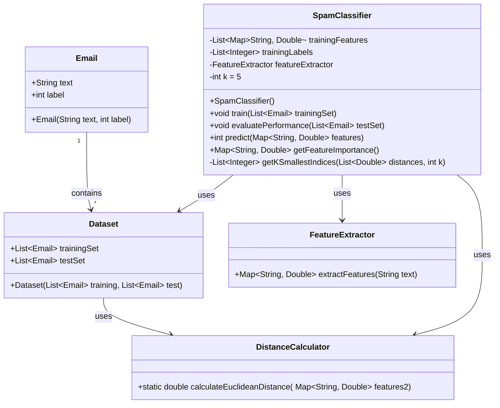

# Text Processing Project Plan/Email Spam Classifier
Spencer Phillips

### Requirements
1. CSV Processing
   - Read input dataset
   - Split into learning/test sets
   - Process individual emails
   - Handle malformed data if needed

2. Feature Extraction
   - Process email text
   - Generate consistent feature set
   - Save features to CSV
   - Generate feature summaries

3. Classification
   - Build spam/not-spam models
   - Implement distance metrics
   - Classify new emails
   - Output predictions

### 1.2 Implementation
- No external libraries
- CLI only
- Predictions output to predictions.txt

## 2. Implementation Structure

### 2.1 File Structure
```
emailprocessing/
├── src/
│   ├── main/
│   │   ├── Main.java
│   │   ├── model/
│   │   │   ├── Email.java              # Email representation
│   │   │   └── Features.java           # Feature container
│   │   ├── utils/
│   │   │   ├── CSVParser.java          # CSV handling
│   │   │   ├── DistanceCalculator.java # Distance metrics
│   │   │   └── FeatureExtractor.java   # Feature extraction
│   │   └── classifier/
│   │       ├── SpamClassifier.java     # Classification logic
│   │       └── ...
├── data/
│   ├── features.csv                    # Extracted features
│   ├── summary.csv                     # Feature summaries
│   └── predictions.txt                 # Classification output
└── README.md
```



### 2.2 Class Structures

```java
public class Email {
    private String rawText;
    private boolean isSpam;
    private Map<String, Double> features;
    
    public void extractFeatures() {
        //
    }
}

public class Features {
    private Map<String, Double> numericFeatures;
    private Map<String, String> textFeatures;
    
    public double getFeatureValue(String name) {
        return numericFeatures.getOrDefault(name, 0.0);
    }
}
```

## 3. Potential Key Features to Extract

1. Text Statistics:
```java
Map<String, Double> features = new HashMap<>();
features.put("length", (double) text.length());
features.put("wordCount", (double) text.split("\\s+").length);
features.put("avgWordLength", calculateAvgWordLength(text));
features.put("urlCount", countUrls(text));
features.put("numberCount", countNumbers(text));
features.put("uniqueWordRatio", calculateUniqueWordRatio(text));
```

2. Pattern Features:
```java
features.put("hasHtml", containsHtml(text) ? 1.0 : 0.0);
features.put("pricePatterns", countPricePatterns(text));
features.put("exclamationRatio", countExclamations(text) / text.length());
features.put("capitalRatio", countCapitals(text) / text.length());
```

## 4. Distance Implementation

```java
public class DistanceCalculator {
    private static final double EUCLIDEAN_WEIGHT = 0.7;
    private static final double EDIT_WEIGHT = 0.3;

    public double calculateDistance(Features f1, Features f2) {
        double euclideanDist = calculateEuclideanDistance(f1.getNumericFeatures(), f2.getNumericFeatures());
        double editDist = calculateEditDistance(f1.getTextFeatures(), f2.getTextFeatures());
        
        return EUCLIDEAN_WEIGHT * euclideanDist + EDIT_WEIGHT * editDist;
    }

    // Distance = sqrt(sum((x1-y1)^2 + (x2-y2)^2 + ...))
    private double calculateEuclideanDistance(Map<String, Double> features1, Map<String, Double> features2) {
        double sumSquaredDiff = 0.0;

        Set<String> allFeatures = new HashSet<>(features1.keySet());
        allFeatures.addAll(features2.keySet());
        
        for (String feature : allFeatures) {
            double val1 = features1.getOrDefault(feature, 0.0);
            double val2 = features2.getOrDefault(feature, 0.0);
            
            double diff = val1 - val2;
            sumSquaredDiff += diff * diff;
        }
        
        return Math.sqrt(sumSquaredDiff);
    }

    private double calculateEditDistance(Map<String, String> features1, Map<String, String> features2) {
        double totalEditDistance = 0.0;
        int featureCount = 0;
        
        Set<String> allFeatures = new HashSet<>(features1.keySet());
        allFeatures.addAll(features2.keySet());
        
        for (String feature : allFeatures) {
            String text1 = features1.getOrDefault(feature, "");
            String text2 = features2.getOrDefault(feature, "");
            
            if (!text1.isEmpty() || !text2.isEmpty()) {
                totalEditDistance += calculateEditDistanceForStrings(text1, text2);
                featureCount++;
            }
        }
        
        return featureCount > 0 ? totalEditDistance / featureCount : 0.0;
    }

    // other distance metrics we end up needing like levenshtein
```

## 5. Testing Strategy
- Feature extraction accuracy
- Model building validation
- Classification accuracy metrics